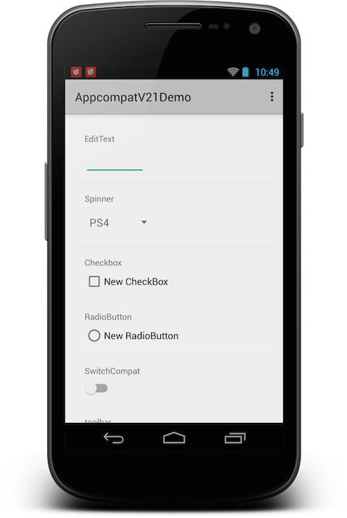

AppcompatV21Demo
================

Demonstrate how to use the lastest android appcompat v21. According to the [blog](http://android-developers.blogspot.sg/2014/10/appcompat-v21-material-design-for-pre.html), include following widgets:

- Everything provided by AppCompat’s toolbar (action modes, etc)
- EditText
- Spinner
- CheckBox
- RadioButton
- Switch (use the new android.support.v7.widget.SwitchCompat)
- CheckedTextView
- toolbar

Screenshot
======

Compile
=========

 1. Update build tools and appcompat plugin to lastest in android sdk. 
 2. And download android 5.0 platform tool.
 3. Start to compile.

Demo download
=======
[baidu pan](http://pan.baidu.com/s/1c0eXhNq)
